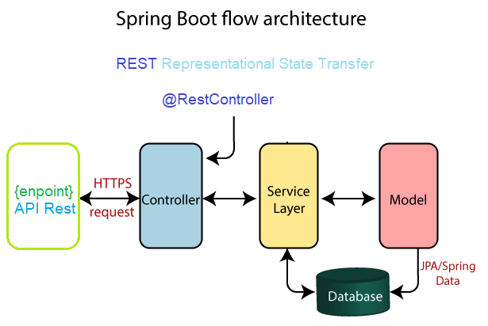
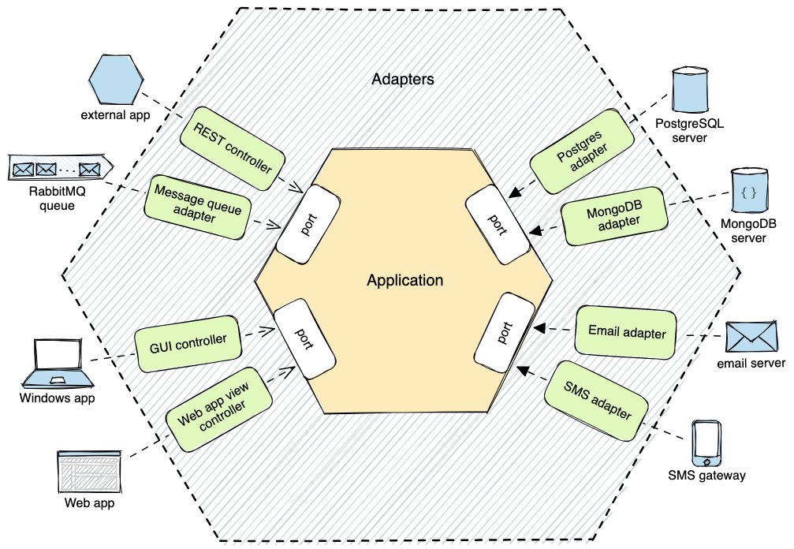
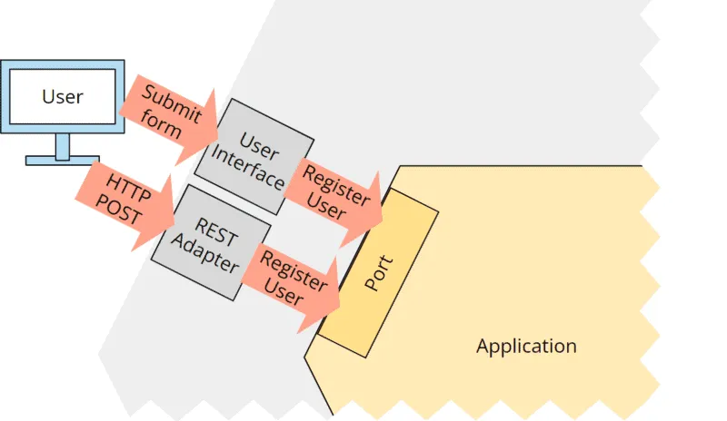
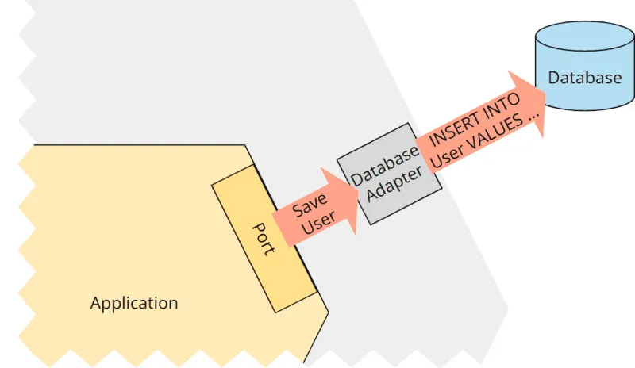
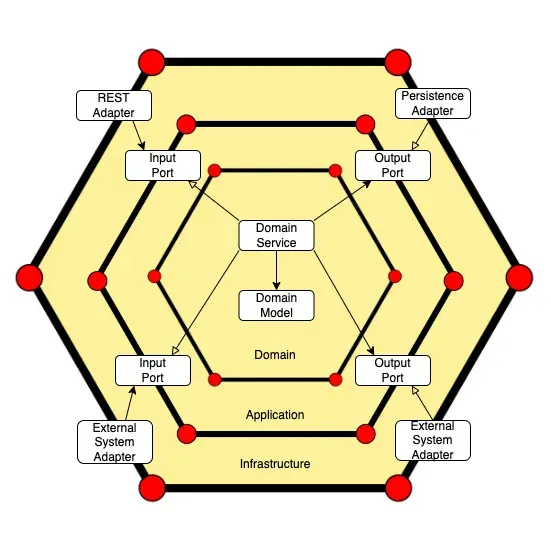

# HEXAGON

### Nab current architecture

* what is the problem?
  * Let's take a tour on an existing one.
  * MVC. phải nhìn nhận rằng đây là mô hình phổ biến bật nhất: ưu điểm như
    * Pros:
        * Simple and Straightforward for Web Applications:
        * Quick Development
        * Easy to Understand and Maintain
    * Cons:
      * Tight Coupling of MVC Components: Changes in the View may necessitate updates in the Controller, leading to maintenance issues.
      * show tấm hình ở đây.
  * Problems:
    * Business logic is in the Service layer, but often still depends on specific technologies like JPA.
    * Limited flexibility. Changing the persistence technology (e.g., from JPA to a different database) still requires modifying the service and repository layers.
    * Works fine for small, simple applications
* Question? làm sao để solve đc vấn đề tight coupling này. làm s để rạch ròi core business và những vấn đề xung quanh.
### HEXAGON architecture
* what is hexagon? 
  * Isolation of Business Logic
  * Ports and Adapters
  * Dependency Inversion Principle: 
  Hexagonal architecture enforces the Dependency Inversion Principle (from SOLID principles), 
where the core application depends only on abstractions (interfaces) and not on concrete implementations. 
This allows external services to change without impacting the core.

  1. Domain/Core logic:
     * focused on implementing the core functionality of the application without any dependencies on external systems like databases or APIs
     * It defines how the application behaves and processes data.
  2. Ports:
     * Ports are interfaces that define the input and output for interacting with the core application logic
     * 2 types:
       * driving ports: inputs to the core, such as requests from the user or external systems
       Primary Adapter
       * 
       * driven ports: outputs from the core, such as calls to a repository or another service
       Secondary Adapter
       * 
  3. Adapters:
     * Adapters are concrete implementations of ports
     * Examples include REST API controllers, repositories, Kafka consumers.
#### This decoupling means that changes in external components (like migrating from one database to another) do not require changes to the core domain logic, thus providing a level of independence between the different parts of the application.

### Comparison
Hexagon
Pros:
* High Flexibility and Independence:
* Improved Testability: easier to test core logic without needing external dependencies. Mocking is straightforward, and tests don’t need to rely on actual databases or APIs
* Easy Integration of Multiple Interfaces:
* Ideal for Complex and Long-Lived Applications:
Cons:
* Complexity and over engineering:
* Higher Initial Development Effort:
* Not suitable for small project
* Learning Curve: understand more abstract concepts like dependency inversion, ports, and adapters

MVC:
Pros:
* Simple and Straightforward for Web Applications:
* Quick Development
* Easy to Understand and Maintain
Cons:
* Tight Coupling Between Components:
* Not Ideal for Complex Business Logic
### Analysis